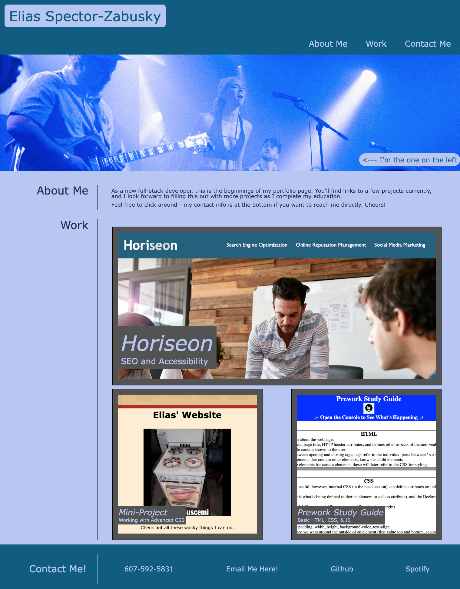
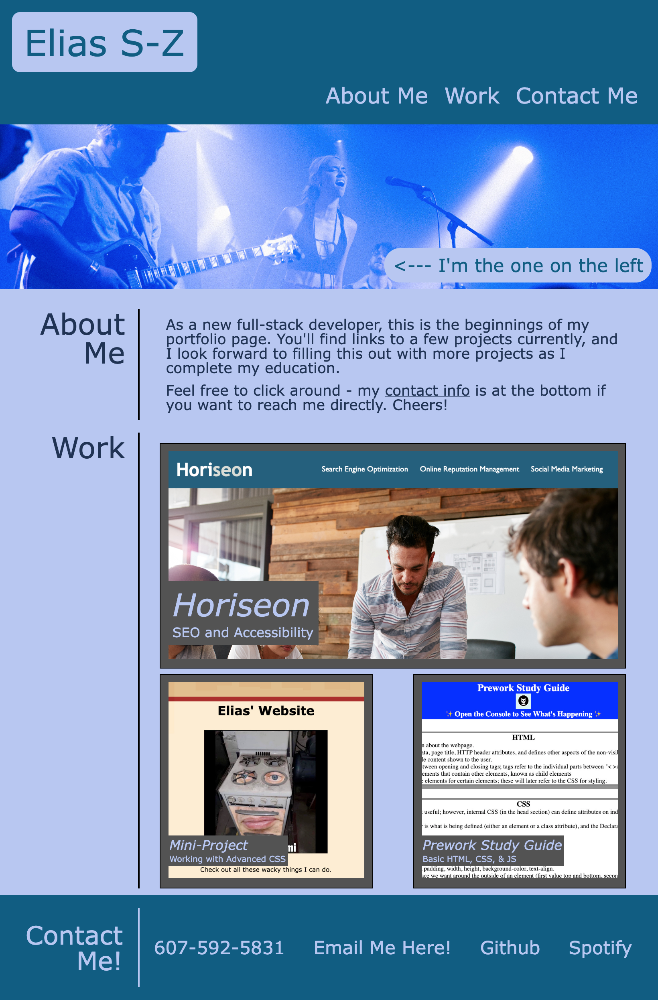
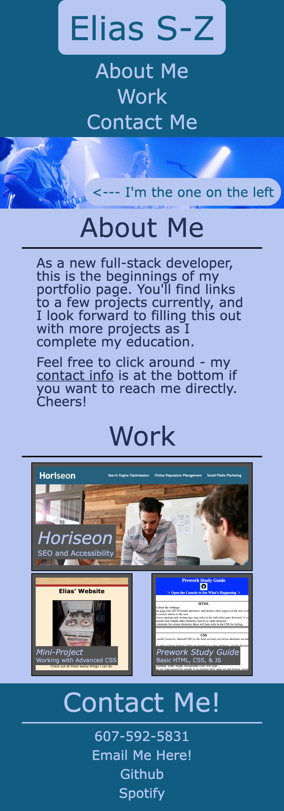

# My Professional Portfolio

## Description

As a full-stack developer, I will need a professional portfolio to help land new jobs and display my projects to potential employers. With the skills developed in my bootcamp so far in CSS and HTML, I built this site to act as my first portfolio. It features a few of my initial projects and challenges from the bootcamp I am currently enrolled in and is both a test of my current skills as much as it is a place to gather my completed projects. It was also my first project in exploring media queries and responsive design.

## Installation

No installation required, please just visit and enjoy!

## Usage

Please click [here](https://coldweatherboyy.github.io/professional-portfolio/) to view deployed site. Below, please find three screenshots of deployed site for desktop, tablet, and smart phone sizes. Sizes for iPad Air and iPhone12Pro used for their respective categories.

## Credits

Coded in [VS Code](https://code.visualstudio.com/).
Received thoughts and second eyes from [Jared Andreassi](https://github.com/jAndreassi) and [Jake Rudlong](https://github.com/JDR8888).